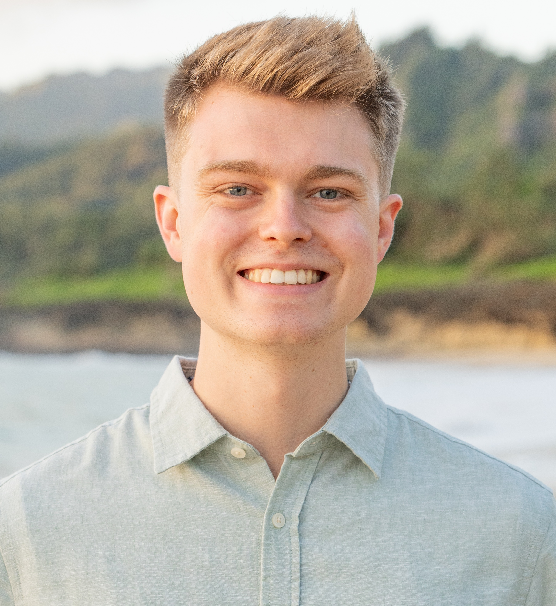

# About Me

{width=150px style="border-radius:50%; float:right; margin-left:15px;"}

Hi, I’m **Dallin Robinson**, a senior at **Brigham Young University** majoring in **Statistics** with minors in **Mathematics** and **Business**. I’m fascinated by the intersection of data, technology, and human decision-making — and I love finding ways to make analytics approachable and useful.

I’ll be starting the **Master of Business & Technology (MBT)** program at **Purdue University** in July 2026, focusing on AI-driven innovation and strategy.

---

## Education

- **Brigham Young University** — B.S. in Statistics, Minors in Math & Business
  *Expected Graduation: April 2026*
  GPA: 3.80 | Major GPA: 4.00
  Spanish Language Certificate (Advanced)
  Member of Mu Sigma Rho, ASA, and BYU Statistics Club

---

## Experience

**Business Systems Consulting Intern – Cache Valley Electric (CVE)** *(Sep 2025 – Present)*
Auditing CVE’s digital asset systems, developing metadata taxonomy, and preparing executive recommendations for AI automation.

**Research Assistant – BYU Statistics Department** *(Sep 2025 – Present)*
Studying neural network dropout methods, focusing on CorEx-based cluster dropout, and contributing to reproducible research experiments.

**Data Science Intern – ON24** *(Mar 2025 – Oct 2025)*
Developed a two-tower recommender model in PyTorch (↑13.1% performance) and deployed an AI-based webinar thumbnail generator using GPT-4o.

**Teaching Assistant – BYU Statistics** *(Jan 2024 – Apr 2025)*
Supported 100+ students each semester in STAT 121 & 230, guiding R-based labs and improving curriculum clarity.

**Legal Operations & Data Analyst Intern – Culwell Legal** *(2023–2024)*
Standardized legal datasets and trained staff on MyCase software, improving compliance and workflow efficiency.

---

## Skills

**Programming & Tools:** Python (pandas, scikit-learn, PyTorch), R (tidyverse), SQL, Tableau, Git, Excel
**Analytics & Modeling:** Regression, recommender systems, feature selection, experimental design
**Soft Skills:** Teaching, communication, leadership, bilingual (English/Spanish)

---

## Get to Know Me

Outside of data science, I love:
- Running and training for Spartan races 🏃
- 3D printing and DIY design projects with my wife, Emma 🧩
- Traveling — we recently spent our honeymoon in Puerto Rico 🌴
- Watching BYU football and exploring new tech gadgets 💻

---

## Connect with Me
[LinkedIn](https://www.linkedin.com/in/dallin-robinson) • [GitHub](https://github.com/dallinrobinson) • [Email](mailto:dallinr.robinson@gmail.com)
